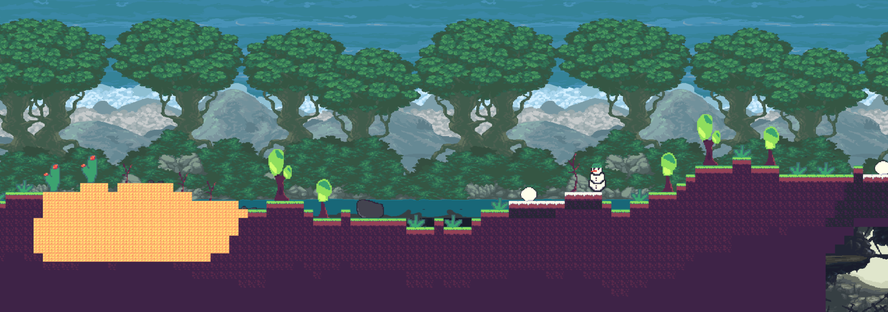

# Rate-02

This is a **2D survival game** in a completely **procedurally** generated world of Rate-02.
The game was developed in *C++* with a help of *third party libraries* such as:
- SDL3
- SDL ttf
- SDL shadercross
- glm
- entt
- imgui
- tinyxml2

I also used my own *graphics library* for rendering objects

## Game
The goal of the game is to rebuild a broken **portal** that is always placed in the middle of the map. In order to do it you would need several items. They can be obtained by killing **enemies**, **mining**, or **crafting**.
Moreover, there are multiple *chests* located on the map that you can open. When you open them they will give you a random item based on the *essence* that you give them. If you decide not to spare any **essence** the items you will get will be of poorer rarity.
Essences are of three different types **Common**, **Sand**, and **Snow** and can be obtained by killing enemies from their biomes. Mummies from the desert to get Sand Essence and so on.

## Keybinds
The game does not support gamepad and it only playable by using a keyboard and a mouse.
| Keyboard Key | Action |
| --- | --- |
| <kbd>W</kbd> or <kbd>Space</kbd> |Jump |
| <kbd>A</kbd> | Move Left |
| <kbd>D</kbd> | Move Right |
| <kbd>Left Mouse Button</kbd> | Mine blocks or objects|
| <kbd>Right Mouse Button</kbd> | Place blocks |

## Assets
Almost all of the assets where created by me except of the ones listed here:

- player sprites - https://biggermanjd.itch.io/platformer-tileset-pixelart-grasslands
- backgrounds sprites - \
https://szadiart.itch.io/sidescroll-worlds-set1 \
https://szadiart.itch.io/sidescroll-worlds-set4

## LICENSE
This game is under MIT LICENSE.

You can view it by following this [link](https://github.com/StanislavDidus/SDL-Procedural-generation/blob/main/LICENSE).

You can view the licenses of other third part libraries used in this project by following this [link](https://github.com/StanislavDidus/SDL-Procedural-generation/tree/main/OTHER_LICENSES)

## How to install the game

- Install .7z file from Releases according to your OS
- Extract all files in an empty folder
- Run the `SDL_PRO_GEN` file

### Or

- clone the repository
- configure and build by using CMake \
  ` cmake --preset {configure-preset}` \
  `cmake --build --preset {build-preset}`\
  You can list all avaiable presets by using this command
  `cmake --list-presets`
- then go to `/out/{configure-preset-name}` and run `SDL_PRO_GEN` \
  If configuring with Visual Studio you might also need to go the directory of the chosen configuration (Debug, Release, or RelWithDebInfo)
